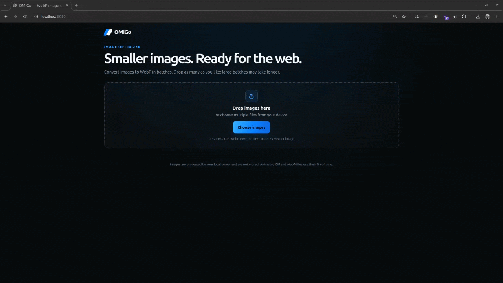

# OMIGo

Optimize My Image with Go — a small, local-first image converter written in Go. Drop raster images into the browser and get optimized WebP files back, individually or in a ZIP.

## Demo



## Features

- Convert JPG/JPEG, PNG, GIF, WebP, BMP, and TIFF images to WebP.
- Add as many images to the queue as your device can handle. Three images are converted concurrently.
- See the overall progress and the original and optimized size for each image.
- Download a single result or download all successful results as a ZIP.
- Preserve transparency. Animated GIF and WebP inputs use their first frame.
- Process images on your own device without a third-party upload service.

## Requirements

- Go 1.23 or later

## Run locally

```sh
go run .
```

Open [http://localhost:8080](http://localhost:8080).

To use a different address or port, set `ADDR`:

```sh
ADDR=127.0.0.1:9090 go run .
```

The server binds to `127.0.0.1:8080` by default, so it is only available on the local machine.

## Build

```sh
go build -o bin/omigo .
```

## Limits and image quality

There is no fixed image-count limit. Each input must be 25 MB or smaller and contain no more than 40 megapixels. WebP output uses quality 90 and compression effort 6. The **Download all** ZIP can contain up to 1 GB total, with a maximum of 50 MB per converted image. Large queues take longer and use more memory in the browser.

## HTTP endpoints

- `GET /` serves the web interface.
- `POST /convert` accepts a multipart form field named `image` and returns one WebP file.
- `POST /download-all` accepts repeated multipart form fields named `images` and returns a ZIP archive.

Temporary multipart files are removed after each request. Conversion results are held in the browser until the queue is cleared or the tab is closed.
